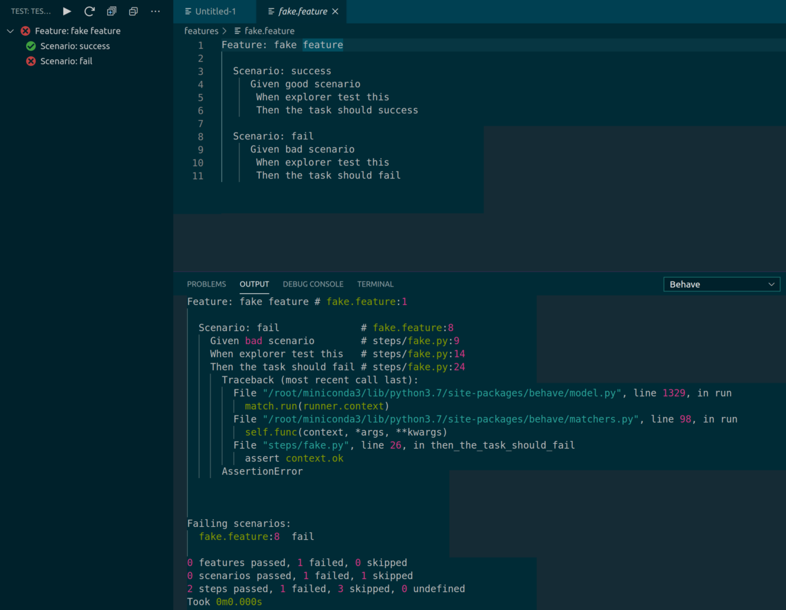

vscode-behave-test-adapter
==========================

Implement [vscode-test-adapter-api][1] for python [behave][2]
---------------------------------------------------------

[Market Place][3]

[1]: https://github.com/hbenl/vscode-test-adapter-api
[2]: https://behave.readthedocs.io/en/latest/index.html
[3]: https://marketplace.visualstudio.com/items?itemName=gwonhs.vscode-behave-test-adapter&ssr=false#overview

Features
--------
* run a specific scenario test
* run a specific feature test
* run all test

Status
------
Alpha

TODO
----
* Increase test coverage
* Watch file changes
* goto source
* etc

Test
----

        $ npm run test

License
-------
* Free software: MIT license